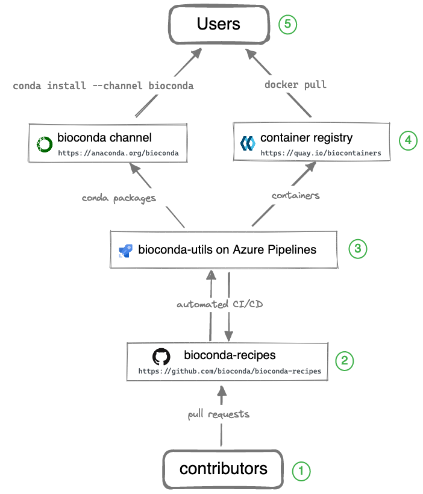

.. image:: images/bioconda.png

**Bioconda** lets you install thousands of software packages related to
biomedical research using the `conda <https://conda.io>`_ package manager.

**NOTE**: *Bioconda supports only 64-bit Linux and macOS*

Usage
=====

First, `install conda`_. Then perform a one-time set up of Bioconda with the
following commands::

    conda config --add channels defaults
    conda config --add channels bioconda
    conda config --add channels conda-forge
    conda config --set channel_priority strict

.. details:: What did these commands do?

    In general, running `conda config` modifies your condarc file which can be
    found at `~/.condarc` by default.

    The first three commands add channels, from lowest to highest priority.
    **The order is important** to avoid problems with solving dependencies::

        conda config --add channels defaults
        conda config --add channels bioconda
        conda config --add channels conda-forge

    - The ``defaults`` channel is the one set by default in a new installation of
      conda. It should be set to the lowest priority.

    - The ``bioconda`` channel enables installation of packages related to
      biomedical research.

    - The ``conda-forge`` channel (see `docs
      <https://conda-forge.org/docs/index.html>`_) enables installation of
      general-purpose packages. Since ``bioconda`` heavily depends on the
      ``conda-forge`` channel, it is set to highest priority.

    This command::

        conda config --set channel_priority strict

    avoids cryptic errors when tryng to install. It ensures that the channel
    priority configured above is respected when solving dependencies. See `this
    section of the conda-forge docs
    <https://conda-forge.org/docs/user/tipsandtricks.html>`_ for more info.

.. details:: What if I don't want to modify my condarc?

    Sometimes you might want to specify the channel priority directly in the
    ``conda`` command-line call when installing a package or creating an
    environment, and not edit the condarc file with the suggested ``conda
    config`` commands above.

    In that case, you would need to add the following arguments to ``conda`` calls::

        --channel conda-forge --channel bioconda --strict-channel-priority

    For example, if you were creating an environment with bwa and samtools in
    it, you would use:

        conda create -n myenv samtools bwa \
          --channel conda-forge \
          --channel bioconda \
          --channel defaults \
          --strict-channel-priority

    Note that conda interprets channels on the command line in order
    of *decreasing* priority (in contrast to ``conda config``, where they are
    listed in increasing priority).

.. _`Install conda`: https://docs.conda.io/projects/conda/en/latest/user-guide/install/index.html

Now you can use ``conda`` to install and use any of the `packages available in
bioconda <conda-package_index.html>`_.

.. details:: How do I speed up package installation?

    Sometimes conda can spend a lot of time trying to solve dependencies for an
    environment. See :ref:`speedup` in the FAQs for some options to improve this.

.. details:: How do I get Docker containers of packages?

    Every conda package in Bioconda has a corresponding Docker `BioContainer`_
    automatically created and uploaded to `Quay.io`_. A list of these and other
    containers can be found at the `BioContainers Registry
    <https://biocontainers.pro/#/registry>`_. For example::

        docker pull quay.io/biocontainers/samtools:1.15.1--h1170115_0

    If you have docker installed, you do not need any additional configuration.

Overview
========

.. role:: circlednumber

The Bioconda channel is the primary output for users, but it takes a team of
contributors and additional infrastructure to make it all happen. The entire
system consists of the components illustrated in the diagram below.

**Legend** (starting from the bottom):

:circlednumber:`①` Over 1400 contributors who add,
modify, update, and maintain recipes and packages

.. details:: Details

    `Contributors
    <https://github.com/bioconda/bioconda-recipes/graphs/contributors>`_ to
    Bioconda add new recipes or update existing recipes by opening pull
    requests to GitHub. Contributors might include:

    - authors of the software
    - Bioconda core team
    - anyone interested creating a conda package

    There's even a Bioconda bot that watches common places
    for updates (like CRAN, PyPI, GitHub releases) and submits a pull
    request with the update for other contributors to review.

:circlednumber:`②` A repository of recipes hosted on GitHub

.. details:: Details

    The full history of all recipes is stored in the `repository of recipes`_
    on GitHub.

    Contributors and Bioconda core team coordinate, collaborate, and
    help each other out via comments on GitHub in issues and pull requests
    which are tested (see :circlednumber:`③`). The goal is to get a working
    package that satisfies the Bioconda policies.

:circlednumber:`③` A build system that turns each recipes into a conda
package and a Docker container

.. details:: Details

    Every time changes are pushed to a GitHub pull request (e.g., new
    recipe or updates to recipe), all of these changes are automatically built
    and tested. The results are reported back to the GitHub pull request page.
    Contributors work together to fix any issues (which are tested again) and
    the process repeats until all tests pass.

    Our `build system`_, `bioconda-utils`, orchestrates the various building
    and testing steps on Azure Pipelines. The output consists of both a `conda
    package`_ and a `Biocontainer`_ that can be inspected before merging the
    pull request.

:circlednumber:`④` A repository of packages and a registry of containers
containing over 8000 bioinformatics packages

.. details:: Details

    When all tests pass and the pull request is merged into the main branch,
    two things happen:

    1. A final conda package is built and uploaded to the `Bioconda channel on
       anaconda.org <https://anaconda.org/bioconda>`_ on anaconda.org.

    2. That same conda package is installed into a Docker container which is
       then uploaded to the `Biocontainers registry
       <https://quay.io/biocontainers>`_.

:circlednumber:`⑤` Users can then use the package with `conda install` or `docker pull`

.. details:: Details

    See above for how to configure the conda channels. Using docker containers
    just needs docker installed.

Package downloads
-----------------

The following plots show the recent usage of Bioconda in terms of number of
downloads.

You can `browse all packages <conda-package_index.html>`_ in the Bioconda
channel.

.. raw:: html
    :file: templates/dashboard.html

Acknowledgments
===============

The Bioconda channel could not exist without support from:

- `Anaconda, Inc <https://www.anaconda.com/>`_ in the form of providing
  unlimited (in time and space) storage for packages in the channel.

- `Circle CI <https://circleci.com/>`_ via an open source plan including free
  Linux and MacOS builds.

- Amazon Web Services in the form of storage for BioContainers as well as
  compute credits.

- `Azure DevOps
  <https://azure.microsoft.com/en-us/services/devops/pipelines/>`_ open source plan

- `GitHub Actions <https://docs.github.com/en/actions>`_ open source plan

The Bioconda logo is a derivative mark of Anaconda :sup:`®`, a trademark of
Anaconda, Inc registered in the U.S. and other countries. Anaconda, Inc. grants
permission of the derivative use but is not associated with Bioconda.

Citing Bioconda
---------------

When using Bioconda please **cite our article**:

  Grüning, Björn, Ryan Dale, Andreas Sjödin, Brad A. Chapman, Jillian
  Rowe, Christopher H. Tomkins-Tinch, Renan Valieris, the Bioconda
  Team, and Johannes Köster. 2018. *Bioconda: Sustainable and
  Comprehensive Software Distribution for the Life Sciences*. Nature
  Methods, 2018 doi::doi:`10.1038/s41592-018-0046-7`.

Contributors
------------

Core
~~~~

* `Johannes Köster <https://github.com/johanneskoester>`_
* `Ryan Dale <https://github.com/daler>`_
* `Brad Chapman <https://github.com/chapmanb>`_
* `Chris Tomkins-Tinch <https://github.com/tomkinsc>`_
* `Björn Grüning <https://github.com/bgruening>`_
* `Andreas Sjödin <https://github.com/druvus>`_
* `Jillian Rowe <https://github.com/jerowe>`_
* `Renan Valieris <https://github.com/rvalieris>`_
* `Marcel Bargull <https://github.com/mbargull>`_
* `Devon Ryan <https://github.com/dpryan79>`_
* `Elmar Pruesse <https://github.com/epruesse>`_

Team
~~~~

Bioconda would not exist without the continuous hard work and support of the
wonderful community which includes over 1400 (as of 2022) `contributors
<https://github.com/bioconda/bioconda-recipes/graphs/contributors>`_.

Table of contents
=================

.. toctree::
   :includehidden:/p

   faqs
   contributor/index
   developer/index
   tutorials/index

.. _conda: https://conda.io/en/latest/index.html
.. _`repository of recipes`: https://github.com/bioconda/bioconda-recipes
.. _`build system`: https://github.com/bioconda/bioconda-utils
.. _`repository of packages`: https://anaconda.org/bioconda/
.. _`conda package`: https://docs.conda.io/projects/conda/en/latest/user-guide/concepts/packages.html
.. _`BioContainer`: https://biocontainers.pro
.. _`Quay.io`: https://quay.io/organization/biocontainers
